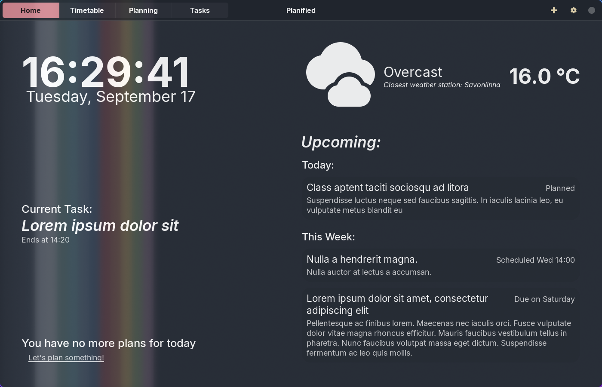

# Planified
*A work in progress task manager for linux built with GTK*


## Building and Installing

``` shell
meson setup build
cd build
sudo meson install
```

## Screenshots
### Home page:


## Feature checklist

- [x] a basic TODO List
- [x] deadlines for tasks
- [x] planning for tasks (i.e do task from x day until y day)
- [x] scheduling for tasks (i.e task happens at x time on y day)
- [x] upcoming task display
- [ ] weather widget
  - [x] basic weather display
  - [ ] autolocation functionality
- [ ] event support
- [ ] ongoing task/event display
- [ ] next task/event display
- [ ] gsettings support
  - [x] weather widget settings
  - [ ] style settings
  - [ ] misc settings
- [ ] task sorting functionality
- [ ] task search functionality
- [ ] task filtering functionality (partially implemented)
